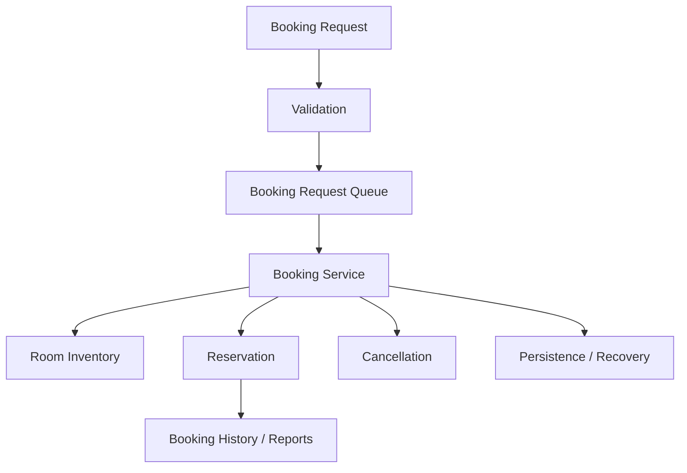

# 🏨 Book My Stay

A Java-based **hotel booking system** developed as a progressive use-case project. The repository models room inventory, booking requests, reservations, validation, booking history, cancellation, concurrency, and persistence/recovery.

## 🖼️ System Architecture



## ✨ Use Cases Covered

The source is organized as incremental use cases, including:

1. Hotel booking application foundation
2. Room initialization
3. Inventory setup
4. Booking request queue
5. Room allocation service
6. Add-on service selection
7. Booking history and reporting
8. Error handling and validation
9. Booking cancellation
10. Concurrent booking simulation
11. Data persistence and recovery

## 🧠 Core Concepts

- Object-oriented design with domain classes such as `Room`, `Reservation`, and `Booking`.
- Separate services for booking, inventory, validation, and reporting.
- Queue-based booking request processing.
- Custom validation and booking exceptions.
- Room types including single, double, and suite rooms.
- Concurrency and persistence explored through later use cases.

## 🧰 Technology


## 🚀 Run a Use Case

Make sure a JDK is installed, then compile and run the desired `.java` use case. For example:

```bash
javac UseCase1HotelBookingApp.java
java UseCase1HotelBookingApp
```

Later use cases can be compiled similarly. Generated `.class` files are already present in the repository, but compiling from source is recommended for reproducibility.

## 📁 Repository Structure

```text
UseCase*.java       # Progressive implementations
Booking*.java       # Booking domain/service classes
Room*.java          # Room and inventory models
Reservation.java    # Reservation model
SystemState.dat     # Persistence state used by the project
```

## 📌 Status

Completed academic Java project / use-case series.

## 👨‍💻 Author

**Dreamjain** — [GitHub](https://github.com/Dreamjain)
